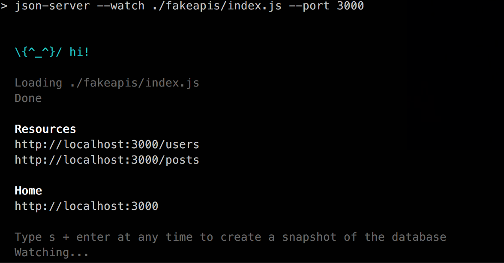

# JSON Server Multiple Files/Resource

JSON Server: https://github.com/typicode/json-server/

## Install

### Install Global

```
npm install -g json-server
```

### Install local

At `json-server-multiple-files/`, run
```
npm install
```

## Structure

```
├── README.md
├── fakeapis
│   ├── index.js
│   ├── posts.json
│   └── users.json
├── package-lock.json
├── package.json
└── screenshot.png
```

## Run JSON server

- `npm start`: Start json server multiple files


## Screen shot


*Note: Check `fakeapis/index.js` and `*.json` for more details.*
